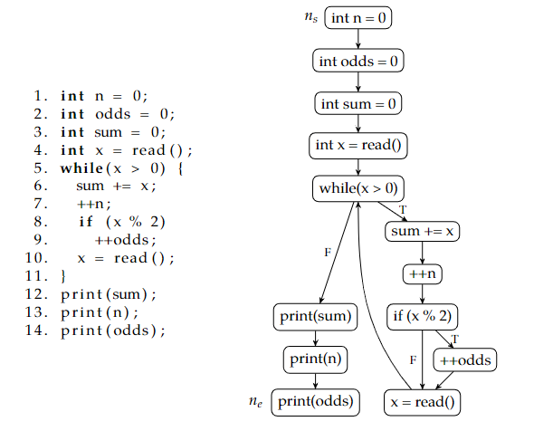

# Map2Check – An Approach to Verifying Programs with Loops Using Program Slicing.
    Oriented by Herbert Rocha
    
[Versão Pt-Br!](./extras/translations/READMEptbr.md)

All the data collected here is available in more details in the Master Thesis of Marek Chalupa. [Click here to see it!](./materials/thesis_PIBIC.pdf) and the user-manual from Frama-c platform. [Click here to see it!](./materials/frama-c-user-manual.pdf) you can also check the oficial website of the platform [Here!](https://frama-c.com/index.html)

---
### TO DO 27/03~10/04:
- [x] Install Frama-C
  - [x] Installation tutorial of the program completed!
- [x] Create a tutorial on how to use https://frama-c.com/fc-plugins/slicing.html
    - [x] Learn how to use the tool
    - [x] Perform tests
- [x] Read Chapter 2 of the Thesis on program slicing
  - [x] 1/3
  - [x] 2/3
  - [x] 3/3

### TO DO 10/04~17/04:
- [ ] Present an example with slides of what program slicing is and how to execute it using Frama-C via command line.
  - [x] (EXTRA!) present an example of program slicing with frama-c GUI
- [ ] Present an example with slides of what program slicing is and how to execute it WITHOUT USING SOFTWARE, for function and instruction as a cutting criterion.
- [x] (EXTRA!) add pt-br support to the repository.
---

## Program Slicing
### What is it?
It's a term used in several  techniques to decompose a program based on data-flow information. It extracts statements of a program that are relevant to the program’s behavior with respect to certain criteria. 

### We can divide program slicing into two categories:
1.  Dynamic analysis, which executes a program and look for erroneous behaviour during the execution of a program.
2.  Static analysis, which does not execute the program at all and tries to draw conclusions about a program only from the source code or some other program representation.
   
### Some definitions:
 - Definition 1. A control flow graph (CFG) of a program P is a quintuple(N, E, 'ns', 'ne', l) where (N, E) is a finite directed graph, N is a set of nodes and E ⊆ N ×N is a set of edges. Each statement of P is represented by a node in the CFG and edges between nodes represent the flow of control in P: there is an edge between nodes n1 and n2 iff n2 can be executed immediately after n1. There are distinguished entry and exit nodes in N, 'ns' and 'ne', such that every node n ∈ N is reachable from 'ns', and 'ne' is reachable from n. Moreover, 'ne' has no outcoming edges. l is a partial labeling function l : E → {T, F} that assigns labels to edges in agreement with the flow of control in P. Let us establish a convention: we do not differentiate between statements of a program P and nodes of its CFG, since the CFG represents the program P (there is one-to-one correspondence). If not stated otherwise, we assume that programs use only if-then-else constructs, no switch or alike. As a result, every node from a CFG has the output degree at most two. 
 
 
- Definition 2. Let (N, E, ns, ne, l) be a CFG of a program P. A run of the program P is a sequence of nodes from the CFG 
  
    n1, n2, n3, . . . , nk

where n1 = ns, nk = ne and for all i, 1 ≤i < k, (ni, ni+1) ∈ E. If a run corresponds to some real execution of a program, we say that it is a feasible run, otherwise it is an unfeasible run. As can be seen

Some versions of control flow graphs do not include unconditional jump statements (goto, break, continue) as a node, but rather represent such statements as an edge. We include all statements of a program P as nodes to get bijective mapping between P and nodes of its CFG. 
    
Every switch statement can be transformed into a sequence of if-then-else statements

    
    a program and its cfg
 

### There are 3 different aproaches we can do to slice a program:
- Data-Flow Aproach: Here we use the original Weiser algorithm to slice a program that does not contain pointers, which compute backward static slices. Where it goes backwards from the points of interest and static because the slice is created independently of a particular run of a program – it preserves a program’s behavior(with respect to a given criterion) on any path that the program can take.

- Use of Dependence Graphs: This time, program dependence graph (PDG) is a slicing method which we use a directed graph that has nodes from a CFG and two kinds of edges – control dependence edges and data dependence edges. Then it forms two subgraphs, control dependence graph and data dependence graph.

- Slicing with pointers and Unstructured control flow: now we can slice programs with pointers and interprocedural control flow.

# FRAMA-C
## What is it?
Frama-C is an open-source extensible and collaborative platform dedicated to source-code analysis of C software. The Frama-C analyzers assist you in various source-code-related activities, from the navigation through unfamiliar projects up to the certification of critical software.

## What it can do?
The collaborative approach of Frama-C allows analyzers to build upon the results already computed by other analyzers in the framework. Thanks to this approach, Frama-C can provide a number of sophisticated tools such as a concurrency safety analysis (Mthread), an enforcer of secure information flow (SecureFlow), or a set of tools for various test coverage criteria (LTest), among many others.

## Frama-C Plugins
Here are some of the most important plugins:

- ## Value
    The Value plugin performs abstract interpretation on C programs to infer information about the possible values of variables and expressions. It can detect potential runtime errors such as null pointer dereferences, buffer overflows, and integer overflows. The plugin can also provide information on variable initialization, pointer aliasing, and interprocedural analysis. It is a powerful tool for both bug-finding and program optimization.

- ## WP
    The WP (Weakest Precondition) plugin is a deductive verification tool that uses mathematical logic to prove the correctness of programs. It can prove properties such as functional correctness, safety properties, and temporal properties. The plugin requires the programmer to provide annotations in the form of preconditions and postconditions, and it uses these annotations to generate proof obligations. The plugin can also generate counterexamples to aid in debugging. It is a powerful tool for ensuring the correctness of critical software.

- ## EVA
    The EVA (Evaluation of C Expressions with Value Analysis) plugin evaluates complex C expressions at compile-time using abstract interpretation. It can provide precise information on the possible values of expressions, making it useful for program optimization and bug-finding. The plugin can also detect potential runtime errors such as null pointer dereferences and division by zero. It is a lightweight and efficient tool for analyzing C code.

- ## Jessie
    The Jessie plugin is a deductive verification tool that uses the Jessie intermediate language to prove the correctness of programs. It requires the programmer to provide annotations in the form of preconditions and postconditions, and it generates proof obligations from these annotations. The plugin supports a variety of programming constructs, including pointers, arrays, and recursion. It is a powerful tool for ensuring the correctness of critical software.

- ## RTE
    The RTE plugin verifies the correctness of programs that use the RTE (Runtime Environment) library of Frama-C. It checks if the library functions are used correctly and if the program meets all runtime restrictions of the library. The plugin is capable of finding errors such as invalid pointers and array bounds violations. Additionally, it verifies if the library functions are called with the correct arguments and if the program does not try to access uninitialized variables. The plugin is useful for ensuring the correctness of programs that use the RTE library in critical environments.

- ## Frama-Clang
    The Frama-Clang plugin is a front-end for Frama-C that allows it to handle C++ code. It uses the Clang compiler to parse the code and generate an AST (Abstract Syntax Tree), which is then passed to Frama-C for analysis. The plugin supports a variety of C++ language features, including templates and namespaces. It is a useful tool for analyzing C++ code using the Frama-C framework.

- ## PathCrawler
    The PathCrawler plugin is a symbolic execution engine for C programs. It explores all possible paths through the program and checks for potential runtime errors such as null pointer dereferences and buffer overflows. The plugin can also generate test cases that exercise different program paths, making it useful for automated testing. It is a powerful tool for analyzing complex C programs.

---

## New versions! [CLICK ME](./extras/NewVersions.md) (pt-br)
## Tutorial for frama-c installation: [CLICK ME!](./extras/TutorialFramaC.md)
## Example of use(interactive mode): [CLICK ME!](./extras/exampleOfInteractivemode.md)
## example of use(command line tool): [CLICK ME!](./extras/exampleOfCLIMode.md)