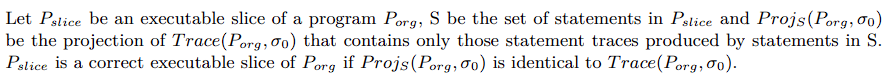
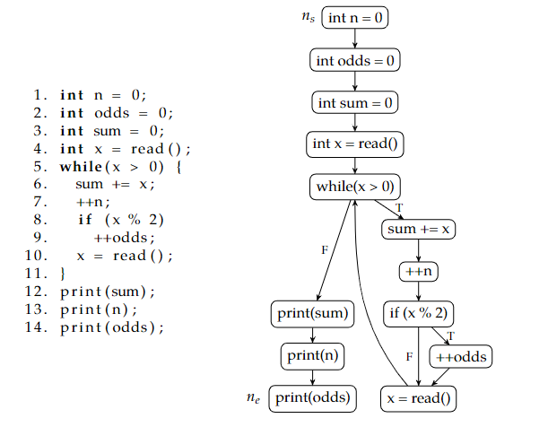

# **Map2Check – An Approach to Verifying Programs with Loops Using Program Slicing.**

Oriented by Professor [Herbert Rocha](https://github.com/hbgit)

### [Versão Pt-Br!](./extras/translations/READMEptbr.md)

<br>

**All the data collected here is available in more details in**

-   the Master Thesis of Marek Chalupa [Click here to see it!](./materials/thesis_PIBIC.pdf).
-   The user-manual from Frama-c platform [Frama-c general User Manual(EN)!](./materials/frama-c-user-manual.pdf)
-   [Frama-c SLICING Manual(FR)](./materials/frama-c-slicing-documentation-french.pdf)
-   you can also check the oficial website of the platform [Here!](https://frama-c.com/index.html).
-   the ESBMC website is [here!](http://esbmc.org/)

## **Objective**

-   Acquire knowledge of program slicing, verification and validation of software through the various tools available in the market
-   test the various tools available in different scenarios
-   contribute to science with this research project

## **TO DO's**

[Click here to see them](./TODO.md)

---

## **PROGRAM VERIFICATION VS PROGRAM VALIDATION**

-   verification: the software should conform to its specification
-   validation: the software should do what the user requires

    **these needs to be aplied at each stage in the software production!**

    With this we can:

    -   discover defect in the system
    -   be certain if the system is usable in an operational situation

### **Static verification**

-   Software inspections are concerned with the analysis of the static system representation to discover problems
-   Generally supplemented by tool-based documents and code analysis
-   Code analysis can prove the **absence of erros** but might present incorrect results

### **Dynamic verification**

-   Software testing is concerned with exercising and observing its behaviors
-   generally executed with test data
-   Can reveal the **PRESENCE OF ERRORS** no their absence

---

## **PROGRAM SLICING**

### **What is it?**

It's a term used in several techniques to decompose a program based on data-flow information. It extracts statements of a program that are relevant to the program’s behavior with respect to certain criteria.

### **Some definitions:**

### **What is a slice?**

-   **Definition by Weiser:**

    The original program and the transformed program must be identical when observed through the window defined by the slicing criterion, defined by a program point and a list of variables. This means that the sequence of values observed for these variables at this point must be the same. In addition, the transformed program must be obtained by suppressing some instructions from the original program.

    This definition was later challenged on the grounds that it is not sufficient to convey the intuitive understanding that we have of slicing.

    example:
    | P | P1 | P2 |
    |:-------:|:------------------:|:------------------:|
    | a = 1 | | a = 1 |
    | b = 3 | | b = 3 |
    | c = a\*b | | |
    | a = 2 | a = 2 | |
    | b = 2 | b = 2 | |
    | d = a+b | d = a+b | d = a+b |

    P1 is probably what we expect from the slicing of P if we are interested in the variable d after the last instruction, but P2 is also correct from Weiser's point of view. Which is ambiguous. It seems unlikely to construct an algorithm that builds P2, but we can still see that the definition is insufficient to fully specify what the result of a slicing should be.

    the formalization of the definition is:

    

    Even though this definition has the same drawbacks as the original one, it allows for correctness proofs of its algorithms relative to this formalization.

### **Dependency Graphs**

-   PDG (Program Dependence Graph). Such a graph is used to represent the various dependencies between the instructions in a program. They exploit it to calculate a non-executable slicing that only concerns instructions that influence the value of variables, but this representation will also be used to calculate an executable slicing.

    ```
    A slice of a program with respect to program point p and variable x consists of a set of statements of the program that might affect the value of x at p.
    ```

-   However, she specifies that x must be defined or used in p. Indeed, when the graph is constructed, the slicing reduces to an accessibility problem to a node, where a node represents a program point and contains only the relationships concerning the variables that appear there. This limitation can be overcome by maintaining a correspondence between the data at a program point and the nodes of the graph.

### **Control Flow Graph(CFG)**

1. **Definition**: A control flow graph (`CFG`) of a program P is a `quintuple(N, E, 'ns', 'ne', L)`:
    1. where `(N, E)` is a finite directed graph;
    2. `N` is a set of nodes and `E ⊆ N × N` is a set of edges.
    3. Each statement of P is represented by a node in the CFG and edges between nodes represent the `flow of control in P`:
        1. there is an edge between nodes `n1` and `n2`
        2. if `n2` can be executed immediately after `n1`.
        3. There are distinguished `entry` and `exit` nodes in `N`, `'ns'` and `'ne'`, such that every node `N ∈ N` is reachable from `'ns'`, and `'ne'` is reachable from `N`.
        4. Moreover, `'ne'` has no outcoming edges.
    4. `L` is a partial `labeling function L`:
    5. `E → {T, F}` that assigns labels to edges in agreement with the flow of control in `P`. <br><br>
    - **Let us establish a convention:** we do not differentiate between statements of a program `P` and `nodes` of its `CFG`, since the `CFG` represents the program `P` (there is one-to-one correspondence).
        - If not stated otherwise, we assume that programs use only **if-then-else** constructs, no `switch` or alike. As a result, every node from a `CFG` has the output degree at most two.

<br>
<br>

2.  **Definition**: Let (N, E, ns, ne, l) be a CFG of a program P. A run of the program P is a sequence of nodes from the CFG

        n1, n2, n3, . . . , nk

    where `n1 = ns`, `nk = ne` and `for all i, 1 ≤i < k, (ni, ni+1) ∈ E`. If a run corresponds to some real execution of a program, we say that it is a **feasible** run, otherwise it is an **unfeasible** run.

    Some versions of control flow graphs do not include unconditional jump statements (`goto, break, continue`) as a node, but rather represent such statements as an edge. We include all statements of a program P as nodes to get bijective mapping between P and nodes of its CFG.

Every switch statement can be transformed into a sequence of if-then-else statements



    a program and its control flow graph

#### **There are 3 different aproaches we can do to slice a program:**

-   Data-Flow Aproach: Here we use the original Weiser algorithm to slice a program that does not contain pointers, which compute backward static slices. Where it goes backwards from the points of interest and static because the slice is created independently of a particular run of a program – it preserves a program’s behavior(with respect to a given criterion) on any path that the program can take.

-   Use of Dependence Graphs: This time, program dependence graph (PDG) is a slicing method which we use a directed graph that has nodes from a CFG and two kinds of edges – control dependence edges and data dependence edges. Then it forms two subgraphs, control dependence graph and data dependence graph.

-   Slicing with pointers and Unstructured control flow: now we can slice programs with pointers and interprocedural control flow.

---

## **PROGRAMMING TOOLS**

### **FRAMA-C Platform**

#### [Click here to see the documentation](./extras/frama-c/FramacTool.md)

---

---

---

### **ESBMC Tool**

#### [Click here to see the documentation](./extras/esbmc/esbmcTool.md)
