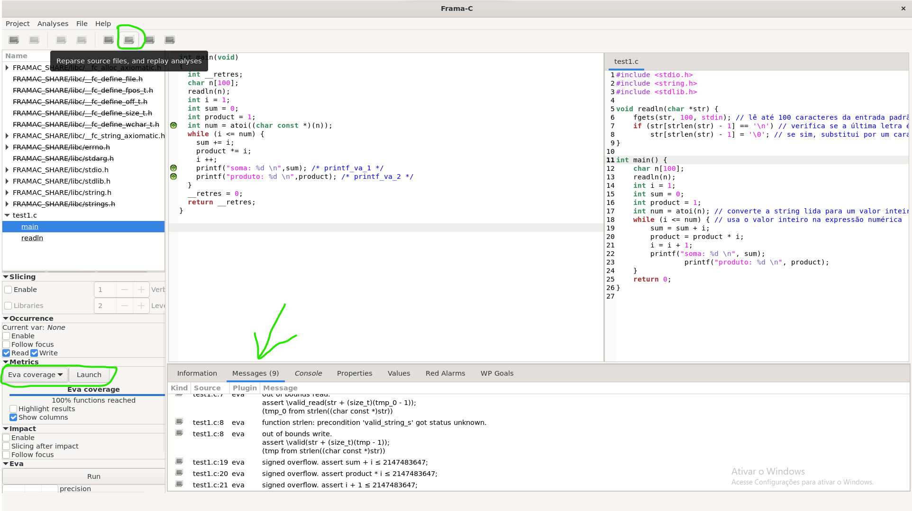

# Map2Check – Uma Abordagem para Verificação de Programas com Loops usando Program Slicing.
    Oriented by Herbert Rocha
    
    
All the data collected here is available in more details in the Master Thesis of Marek Chalupa. [Click here to see it!](./initial%20slides/thesis_PIBIC.pdf) and the user-manual from Frama-c platform. [Click here to see it!](./initial%20slides/frama-c-user_manual.pdf) you can also check the oficial website of the platform [Here!](https://frama-c.com/index.html)

---
### TO DO 27/03~10/04:
- [x] Instalar o Frama-C
  - [x] tutorial de instação do programa concluído!
- [x] Criar um tutorial de como usar https://frama-c.com/fc-plugins/slicing.html
    - [x] aprender a usar a ferramenta
    - [x] fazer testes
- [x] Ler o Capitulo 2 da Tese sobre program slicing
  - [x] 1/3
  - [x] 2/3
  - [x] 3/3
---

## Program Slicing
### What is it?
It's a term used in several  techniques to decompose a program based on data-flow information. It extracts statements of a program that are relevant to the program’s behavior with respect to certain criteria. 

### We can divide program slicing into two categories:
1.  Dynamic analysis, which executes a program and look for erroneous behaviour during the execution of a program.
2.  Static analysis, which does not execute the program at all and tries to draw conclusions about a program only from the source code or some other program representation.
   
### Some definitions:
 - Definition 1. A control flow graph (CFG) of a program P is a quintuple(N, E, 'ns', 'ne', l) where (N, E) is a finite directed graph, N is a set of nodes and E ⊆ N ×N is a set of edges. Each statement of P is represented by a node in the CFG and edges between nodes represent the flow of control in P: there is an edge between nodes n1 and n2 iff n2 can be executed immediately after n1. There are distinguished entry and exit nodes in N, 'ns' and 'ne', such that every node n ∈ N is reachable from 'ns', and 'ne' is reachable from n. Moreover, 'ne' has no outcoming edges. l is a partial labeling function l : E → {T, F} that assigns labels to edges in agreement with the flow of control in P. Let us establish a convention: we do not differentiate between statements of a program P and nodes of its CFG, since the CFG represents the program P (there is one-to-one correspondence). If not stated otherwise, we assume that programs use only if-then-else constructs, no switch or alike. As a result, every node from a CFG has the output degree at most two. 
<br>
<br>
- Definition 2. Let (N, E, ns, ne, l) be a CFG of a program P. A run of the program P is a sequence of nodes from the CFG 
  
        n1, n2, n3, . . . , nk

    where n1 = ns, nk = ne and for all i, 1 ≤i < k, (ni, ni+1) ∈ E. If a run corresponds to some real execution of a program, we say that it is a feasible run, otherwise it is an unfeasible run. As can be seen

    Some versions of control flow graphs do not include unconditional jump statements (goto, break, continue) as a node, but rather represent such statements as an edge. We include all statements of a program P as nodes to get bijective mapping between P and nodes of its CFG. 
    
    Every switch statement can be transformed into a sequence of if-then-else statements


    
    a program and its cfg
<br>

### There are 3 different aproaches we can do to slice a program:
- Data-Flow Aproach: Here we use the original Weiser algorithm to slice a program that does not contain pointers, which compute backward static slices. Where it goes backwards from the points of interest and static because the slice is created independently of a particular run of a program – it preserves a program’s behavior(with respect to a given criterion) on any path that the program can take.

- Use of Dependence Graphs: This time, program dependence graph (PDG) is a slicing method which we use a directed graph that has nodes from a CFG and two kinds of edges – control dependence edges and data dependence edges. Then it forms two subgraphs, control dependence graph and data dependence graph.

- Slicing with pointers and Unstructured control flow: now we can slice programs with pointers and interprocedural control flow.

# FRAMA-C
## What is it?
Frama-C is an open-source extensible and collaborative platform dedicated to source-code analysis of C software. The Frama-C analyzers assist you in various source-code-related activities, from the navigation through unfamiliar projects up to the certification of critical software.
## New versions! [CLICK ME](./extras/informacoesimportantes.md) (pt-br)
## Tutorial for installation: [CLICK ME!](./extras/TutorialPSFramaC.md)

## What it can do?
The collaborative approach of Frama-C allows analyzers to build upon the results already computed by other analyzers in the framework. Thanks to this approach, Frama-C can provide a number of sophisticated tools such as a concurrency safety analysis (Mthread), an enforcer of secure information flow (SecureFlow), or a set of tools for various test coverage criteria (LTest), among many others.
## Example of use:
- first, with the frama-c interactive version opened, you can access your original source code with the options at the top left corner and run the tests with the EVA plugin. Just like the image below. ⬇️
 
- you can see that your code is displayed at the right corner of the screen, which cannot be modified, you need to reach the option in the right side of where you went to put the modified code in the tool.
- the below section shows you the messages of the analysis and other properties. 
- here is a example of my code which was improved by the analysis of the tool, which i discovered that the variables of my code were reaching overflow. I solved the problem typing them to unsigned long long. [you can see it here](./tests/test1.c)
    ```
    void readln(char *str) {
        fgets(str, 100, stdin); // lê até 100 caracteres da entrada padrão (teclado) e armazena em 'str'
        if (str[strlen(str) - 1] == '\n') // verifica se a última letra é um caractere de nova linha
            str[strlen(str) - 1] = '\0'; // se sim, substitui por um caractere nulo
    }

    int main() {
        char n[100];
        readln(n);
        int i = 1;
        unsigned long long sum = 0; // utilizamos o tipo de dados unsigned long long para evitar overflow em sum
        unsigned long long product = 1; // msm caso de sum
        int num = atoi(n);
        while (i <= num) {
            sum = sum + i;
            product = product * i;
            i = i + 1;
            printf("soma: %llu \n", sum); // utilizamos o especificador de formato %llu para imprimir valores unsigned long long
            printf("produto: %llu \n", product); 
        }
        return 0;
    }
    ```