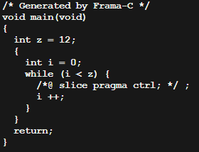

# **Command Line Mode**

## **Explanations about the slicing plugin and how it works:**

## **The Frama-C Slicing plugin offers several command line options to specify slicing criteria. Here are some of the available options:**

<br>

## **-slice-calls f1,...,fn: Selects each call to functions f1,…,fn and all their effects.**

-   The slice-calls option in Frama-C allows the user to specify which function calls should be included in the slicing. When used with the main() function, it specifies that all function calls within main() that affect the slicing criteria should be included.

-   For example, if we have a program with multiple function calls within main(), we can use the slice-calls option to include only the relevant function calls in the slicing. Suppose we have a program like the following:

    ```c
    #include <stdio.h>
    int foo(int x) {
        return x + 1;
    }

    int bar(int y) {
        return y * 2;
    }

    int main() {
        int a = 10;
        int b = 20;
        int c = foo(a)
        printf("%d\n", c);
        return 0;
    }
    ```

-   If we want to slice the program based on the value of c, we can use the slice-calls option with `main()` and specify `foo()` and `bar()` as the relevant function calls:

    ```bash
    frama-c ./test5.c -deps -main main -slice-calls main,foo,bar -slice-value c -then-on 'Slicing export' -set-project-as-default -print -then -print -ocode ./test5.c -then ./test5.c -no-deps
    ```

-   This will generate a sliced program that includes only the relevant parts of `main()`, `foo()`, and `bar()` that affect the value of c.

-   Note that we can also **use** the `slice-calls` option with other functions besides `main()`, and we can specify multiple functions separated by commas.

---

## **-slice-return f1,...,fn: Selects the result (returned value) of functions f1,…,fn.**

-   The option `-slice-return` defines the code slicing criterion based on the dependency between the input variables and the output(return) variable of the specified function.

-   see the example of code which we'll be exemplifying here:

    ```c
    #include <stdio.h>
    int sum(int x, int y) { return (x + y); }

    int mult(int x, int y) { return (x * y); }

    int main() {
    int a = 0;
    int b = 1;
    int c = 2;

    printf("x: %d\n", a);
    printf("y: %d\n", b);
    printf("z: %d\n", c);
    sum(a, b);
    printf(mult(a,b));
    printf(sum(b, c));
    return 0;
    }
    ```

-   In this case, since the `main()` function does not return any value, we can define the output variable as the variable "c" that is printed on line 8.

    ```bash
    frama-c ./test5.c -deps -main main -slice-return main -slice-value c -then-on 'Slicing export' -set-project-as-default -print -then -print -ocode ./sliced_test5.c -then ./sliced_test5.c -no-deps
    ```

---

## **-slice-value v1,...,vn: Selects the result of the values on the left-hand side v1,…,vn at the end of the function given as an entry point.**

-   The `-slice-value` option in Frama-C allows you to specify which variables in the code you want to include in the slicing criteria.

-   For example, suppose you have a C code with multiple variables, but you are only interested in the slicing criteria for two specific variables x and y. You can use the option `-slice-value x,y` to indicate that you want the slicing to consider only the statements that affect the values of x and y.

-   For instance, suppose we want to slice the program to only include the variables a and c. We can use the following command:

    ```bash
    frama-c ./test5.c -deps -main main -slice-calls foo,bar -slice-value a,c -then-on 'Slicing export' -set-project-as-default -print -then -print -ocode ./sliced_test5.c -then ./sliced_test5.c -no-deps
    ```

-   This command tells Frama-C to slice the program based on the calls to functions foo and bar, and only include variables a and c in the resulting slice. The `-then-on 'Slicing export'` option is used to export the resulting slice, and `-ocode sliced.c` is used to save the sliced program to a file named sliced.c.
-   After running this command, Frama-C generates a sliced version of the program that only includes the statements relevant to the variables a and c. The resulting sliced code would look like this:

    ```c
    int foo(int x) {
        return x + 1;
    }

    int main() {
        int a = 10;
        int c = foo(a);
        printf("%d\n", c);
        return 0;
    }
    ```

---

## **-slice-wr v1,...,vn: Selects the write accesses to the left-hand side values v1,…,vn.**

-   this command is related to the moment the variable is "written" in the code, like `int x = 10;`

---

## **-slice-rd v1,...,vn: Selects the read accesses to the left-hand side values v1,…,vn.**

-   if we run the command:

    ```bash
    frama-c ./test5.c -deps -main main -slice-calls foo,bar -slice-wr x -slice-rd y -then-on 'Slicing export' -set-project-as-default -print -then -print -ocode ./sliced_test5.c -then ./sliced_test5.c -no-deps
    ```

-   we are telling Frama-C to slice the program based on calls to the foo and bar functions, as well as on writes to the variable x and reads from the variable y.

    -   The resulting slice would include only the statements that affect the values of x and y, which in this case are the assignments `x = foo(a)` and `y = bar(b)`.

        ```c
        int foo_slice_1(int x)
        {
            int **retres;
            **retres = x + 1;
            return \_\_retres;
        }

        void main(void)
        {
            int a = 10;
            int c = foo_slice_1(a);
            return;
        }
        ```

---

## Slicing criteria can also be specified in the source code using slicing pragmas and the following command line option:

## **-slice-pragma f1,...,fn: Uses slicing pragmas in the code of functions f1,…,fn as slicing criteria.**

-   The `-slice-pragma` option in Frama-C is used to slice the code with respect to user-defined slicing pragmas. Pragmas are preprocessor directives that provide additional information to the compiler and can be used to customize the behavior of the slicing process.

-   you can use slicing pragmas to specify the parts of the code that you want to preserve in the sliced program. To do this, you can add `//@ slice pragma` annotations in your source code. The syntax for adding a slicing pragma is:
    ```
    //@ slice pragma "name";
    ```
    -   there are 3 types of slicing pragmas that can be used to specify the parts of the code that you want to preserve in the sliced program:
        -   `/*@ slice pragma ctrl; */`: This pragma preserves the reachability of the control-flow point where it is placed. It ensures that the control flow of the sliced program will reach this point, just like in the original program. In other words, this line is often used in loops and conditionals which maintain the code in the control flow. See the example below:
        -   [code](../../tests/simple_tests/test7.c)  
            In this code we can see that the `/_@ slice pragma ctrl; _/` is being used inside the for loop to main it in the output of the framac, see the expected output below:
        -   
            -   we can use this multiple times to make explicit control flow of different definitions of the code, in other words, necessary code for the execution of the program.
        -   `/*@ slice pragma expr e; */`: This pragma preserves the value of the ACSL expression `e`(this e can be changed for anything) at the control-flow point where it is placed. It ensures that the value of the expression `e` will be the same in both the original and the sliced programs.
        -   `/*@ slice pragma stmt; */`: This pragma preserves the effects of the statement immediately following the pragma. It ensures that the statement will be included in the sliced program, and its effects will be the same as in the original program.
-   Here, "name" is the user-defined name for the slicing pragma. For example, consider the following code:

    ```c
    #include <stdio.h>

    int main() {
        int a = 10;
        int b = 20;

        //@ slicing_pragma "keep_addition";
        int c = a + b;

        int d = a * b;

        printf("Sum: %d\n", c);
        printf("Product: %d\n", d);

        return 0;
    }
    ```

-   In this code, we have added a slicing pragma "keep_addition" before the addition operation. Now, if you want to slice the code while preserving the addition operation, you can use the -slice-pragma option with Frama-C:

    ```bash
    frama-c -slice-pragma keep_addition .c -then-on 'Slicing export' -print
    ```

-   The resulting sliced code will preserve the addition operation and remove the multiplication operation:

    ```c
    void main(void)
    {
    int a;
    int b;
    int c;
    a = 10;
    b = 20;
    /*@ slicing_pragma "keep_addition"; */
    c = a + b;
    printf("Sum: %d\n", c);
    return;
    }
    ```

Using slicing pragmas and the -slice-pragma option, you can have more control over which parts of the code you want to keep or remove during the slicing process

---

## In addition, slicing criteria can be relative to ACSL annotations. In this case, the Slicing plugin ensures that if a property is verified by the sliced code, this implies that the corresponding property is satisfied by the initial code.

## **-slice-assert f1,...,fn: Selects the assertions of functions f1,…,fn.**

-   **WHAT IS AN ASSERTION?**

    -   An assert is a statement that something is true or exists, often made confidently and forcefully without the need for proof or regard for evidence. Generally used for debbugin purposes.

-   **How does it works:**

    -   The `-slice-assert` option is used to specify that the slicer should preserve the assertions in the specified functions. This means that the resulting sliced code will still satisfy the assertions present in the original code for the given functions. See the example below:

    ```c
    #include <assert.h>
    int main() {
    double a = 3;
    double b = 4;
    double c = 123;

        //@ assert(b >= 0);

        double d = a / b;
        c = a;

        return 0;
    }
    ```

-   if we use the command:

    ```bash
    frama-c -slice-assert main test6.c -then-on 'Slicing export' -set-project-as-default -print -ocode ./sliced_test6_assert1.c
    ```

    -   we can see that frama-c took the ` //@ assert(b >= 0);` parameter inside the code in the declaration of main function, where we choose the assertion of b in the code. Look how it gone:

    ```c
    /* Generated by Frama-C */
    void main(void)
    {
    double b = (double)4;
    /*@ assert b ≥ 0; */ ;
    return;
    }
    ```

-   in other case, if we change the assertion to ` //@ assert(c >= 0);`, the slice will be:

    ```c
    /* Generated by Frama-C */
    void main(void)
    {
    double c;
    double a = (double)3;
    c = a;
    /*@ assert c ≥ 0; */ ;
    return;
    }
    ```

-   **this means that we can use different asserts in a similar way as of `-slice-value` or other functions depending on how we use the assert inside the code**

---

## **-slice-loop-inv f1,...,fn: Selects the loop invariants of functions f1,…,fn.**

---

## **-slice-loop-var f1,...,fn: Selects the loop variants of functions f1,…,fn.**

---

## **-slice-threat f1,...,fn: Selects the threats (issued by Eva) of functions f1,…,fn.**

### Several of these options can be used simultaneously to specify a complex slicing criteria. Note that the order of options does not affect the slicing result.

---

---

---

## Now, for some examples we'll take the code: [click here to see it](../tests/)

### testing commands:

```bash
frama-c loop_simple.i -deps -slice-return main -then-on 'Slicing export' -set-project-as-default -print  -then -print -ocode ./ocode_@PTEST_NUMBER@_@PTEST_NAME@.c -then ./ocode_@PTEST_NUMBER@_@PTEST_NAME@.c  -no-deps

frama-c test2.c -deps -slice-calls sum,mult -slice-value x,y  -then-on 'Slicing export' -set-project-as-default -print  -then -print -ocode ./ocode_@PTEST_NUMBER@_@PTEST_NAME@.c -then ./ocode_@PTEST_NUMBER@_@PTEST_NAME@.c  -no-deps

frama-c ./test4.c -deps -main main -slice-return sum -then-on 'Slicing export' -set-project-as-default -print  -then -print -ocode ./sliced_test4_returnSum.c -then ./sliced_test4_returnSum.c  -no-deps

frama-c ./test5.c -deps -main main -slice-calls main,foo,bar -slice-value c -then-on 'Slicing export' -set-project-as-default -print  -then -print -ocode ./test5.c -then ./test5.c  -no-deps

frama-c ./test5.c -deps -main main -slice-wr b -then-on 'Slicing export' -set-project-as-default -print  -then -print -ocode ./ocode_@PTEST_NUMBER@_@PTEST_NAME@.c -then ./ocode_@PTEST_NUMBER@_@PTEST_NAME@.c  -no-deps
```

### explaining the complete commands:

Frama-c does not parses its command line in an unspecified order and runs its actions according to the read options. <br>
Which means that command needs to be wrote in **order left to right**.

-   `frama-c` is the default command to execute the program

-   `-deps` option generates the dependency between functions in the analyzed program. This means that it identifies which
    functions are called by which other functions, allowing the tool to analyze the impact of changes made in one function on the behavior of other functions.

-   `-main <function_name>` specifies that all analyzers should treat function function_name as the entry point of the program.

-   `-slice-OPTION` option tells Frama-C that the slicing criterion is specifically related to the given function. It is usually important to set the function to be analyzed using the `-main <function_name>` option before this.

-   `-then` option parses its command line until the option -then and runs its actions accordingly, then it parses its command line from this option to the end (or to the next occurrence of -then). <br>

-   `-ocode <file name>` redirects all output code of the current project to the designated file.

---

---

---

## Complex frama-c tests : [Click me!](./ComplexFramaCTests.md)

---

## to go back to the previous page: [Click me!](./FramacTool.md)
