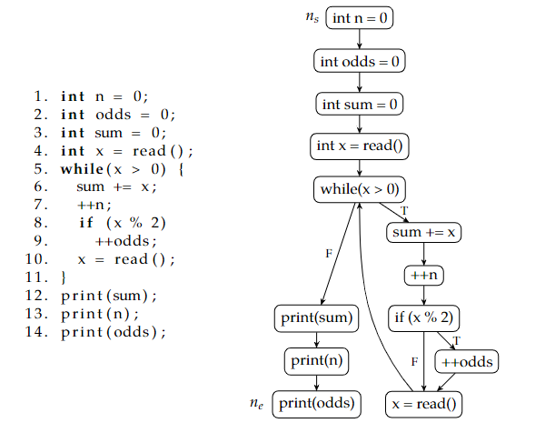

# Map2Check – Uma Abordagem para Verificação de Programas com Loops usando Program Slicing.

    Orientado por Herbert Rocha

Todos os dados coletados aqui estão disponíveis em mais detalhes na Tese de Mestrado de Marek Chalupa. [Clique aqui para vê-la!](../../materials/thesis_PIBIC.pdf) e no manual do usuário da plataforma Frama-c. [Clique aqui para vê-lo!](../../materials/frama-c-user-manual.pdf) Você também pode conferir o site oficial da plataforma [aqui!](https://frama-c.com/index.html)

---

### TO DO 27/03~10/04:

-   [x] Instalar o Frama-C
    -   [x] tutorial de instalação do programa concluído!
-   [x] Criar um tutorial de como usar https://frama-c.com/fc-plugins/slicing.html
    -   [x] aprender a usar a ferramenta
    -   [x] fazer testes
-   [x] Ler o Capitulo 2 da Tese sobre program slicing
    -   [x] 1/3
    -   [x] 2/3
    -   [x] 3/3

### TO DO 10/04~17/04:

-   [x] Apresentar um exemplo com slides do que consiste e como executar o program slicing usando o Frama-C via linha de comando.
    -   [x] (EXTRA) apresentar exemplo de slicing de código com o Frama-C GUI!
-   [ ] Apresentar um exemplo com slides do que consiste e como executar o program slicing SEM O USO DE SOFTWARE, para função e instrução como critério de corte.
    -   [x] (EXTRA) adicionar suporte ao pt-br

---

### TO DO 10/04~17/04:

-   [ ] Present an example with slides of what program slicing is and how to execute it using Frama-C via command line.
    -   [x] (EXTRA!) present an example of program slicing with frama-c GUI
-   [ ] Present an example with slides of what program slicing is and how to execute it WITHOUT USING SOFTWARE, for function and instruction as a cutting criterion.
-   [x] (EXTRA!) add pt-br support to the repository.

---

## Program Slicing

### O que é?
É um termo usado em diversas técnicas para decompor um programa com base em informações de fluxo de dados. Ele extrai declarações de um programa que são relevantes para o comportamento do programa em relação a certos critérios.

### Podemos dividir o slicing de programas em duas categorias:

1.  Análise dinâmica, que executa um programa e busca por comportamentos errôneos durante a execução do programa.
2.  Análise estática, que não executa o programa e tenta tirar conclusões sobre um programa apenas do código-fonte ou de alguma outra representação do programa.

### algumas definições:

-   Definição 1. Um grafo de fluxo de controle (CFG) de um programa P é um quintuplo (N, E, 'ns', 'ne', l), onde (N, E) é um grafo direcionado finito, N é um conjunto de nós e E ⊆ N × N é um conjunto de arestas. Cada instrução de P é representada por um nó no CFG e as arestas entre os nós representam o fluxo de controle em P: há uma aresta entre os nós n1 e n2 se n2 pode ser executado imediatamente após n1. Existem nós de entrada e saída distinguidos em N, 'ns' e 'ne', de modo que todo nó n ∈ N seja alcançável a partir de 'ns', e 'ne' seja alcançável a partir de n. Além disso, 'ne' não possui arestas de saída. l é uma função de rotulagem parcial l: E → {T, F} que atribui rótulos às arestas em concordância com o fluxo de controle em P. Vamos estabelecer uma convenção: não diferenciamos entre as instruções de um programa P e os nós de seu CFG, já que o CFG representa o programa P (há uma correspondência um a um). Se não for declarado de outra forma, assumimos que os programas usam apenas construções if-then-else, sem switch ou semelhantes. Como resultado, todo nó de um CFG tem grau de saída de no máximo dois.
     
     
-   Definição 2. Seja (N, E, ns, ne, l) um CFG de um programa P. Uma execução do programa P é uma sequência de nós do CFG.

    n1, n2, n3, . . . , nk

Definição 2. Seja (N, E, ns, ne, l) um CFG de um programa P. Uma execução do programa P é uma sequência de nós do CFG onde n1 = ns, nk = ne e para todo i, 1 ≤ i < k, (ni, ni+1) ∈ E. Se uma execução corresponde a alguma execução real de um programa, dizemos que ela é uma execução viável, caso contrário, é uma execução inviável. Como pode ser observado,

    a program and its cfg

 

Algumas versões de fluxo de controle de grafo não incluem instruções de salto incondicional (goto, break, continue) como um nó, mas representam tais instruções como uma aresta. Incluímos todas as instruções de um programa P como nós para obter uma correspondência biunívoca entre P e os nós de seu CFG.

Cada declaração switch pode ser transformada em uma sequência de declarações if-then-else.

### Existem três abordagens diferentes que podemos usar para fazer o slicing de um programa:

-   Abordagem de Fluxo de Dados: Aqui usamos o algoritmo original de Weiser para fatiar um programa que não contém ponteiros, que calcula fatias estáticas retroativas. Ele retrocede a partir dos pontos de interesse e é estático porque a fatia é criada independentemente de uma execução particular do programa - ela preserva o comportamento de um programa (com relação a um critério dado) em qualquer caminho que o programa possa tomar.

-   Uso de Gráficos de Dependência: Neste caso, o grafo de dependência do programa (PDG) é um método de slicing no qual usamos um grafo direcionado que possui nós de um CFG e dois tipos de arestas - arestas de dependência de controle e arestas de dependência de dados. Em seguida, forma-se dois subgráficos, o grafo de dependência de controle e o grafo de dependência de dados.

-   Slicing with pointers and Unstructured control flow: now we can slice programs with pointers and interprocedural control flow.

# FRAMA-C

## O que é?

O Frama-C é uma plataforma colaborativa e extensível de código aberto dedicada à análise de código-fonte de software em C. Os analisadores do Frama-C ajudam em várias atividades relacionadas ao código-fonte, desde a navegação por projetos desconhecidos até a certificação de software crítico.

## O que ele pode fazer?

A abordagem colaborativa do Frama-C permite que os analisadores construam sobre os resultados já calculados por outros analisadores no framework. Graças a essa abordagem, o Frama-C pode fornecer uma série de ferramentas sofisticadas, como análise de segurança de concorrência (Mthread), um aplicativo para garantir o fluxo seguro de informações (SecureFlow) ou um conjunto de ferramentas para vários critérios de cobertura de teste (LTest), entre muitos outros.

## Plugins Frama-C

Aqui estão alguns dos principais plugins do Frama-c:

-   ## Value

    O plugin Value realiza interpretação abstrata em programas C para inferir informações sobre os possíveis valores de variáveis e expressões. Ele pode detectar possíveis erros em tempo de execução, como referências nulas de ponteiro, estouro de buffer e estouro de inteiro. O plugin também pode fornecer informações sobre inicialização de variáveis, aliasing de ponteiro e análise interprocedural. É uma ferramenta poderosa tanto para detecção de bugs quanto para otimização de programas.

-   ## WP

    O plugin WP (Weakest Precondition) é uma ferramenta de verificação dedutiva que utiliza lógica matemática para provar a correção de programas. Ele pode provar propriedades como correção funcional, propriedades de segurança e propriedades temporais. O plugin requer que o programador forneça anotações na forma de precondições e pós-condições, e usa essas anotações para gerar obrigações de prova. O plugin também pode gerar contraexemplos para ajudar na depuração. É uma ferramenta poderosa para garantir a correção de software crítico.

-   ## Mthread

    This plugin detects potential concurrency issues such as data races, deadlocks, or inconsistent lock usage

-   ## EVA

    O plugin EVA (Avaliação de Expressões C com Análise de Valores) avalia expressões C complexas em tempo de compilação usando interpretação abstrata. Ele pode fornecer informações precisas sobre os possíveis valores de expressões, tornando-o útil para otimização de programas e detecção de bugs. O plugin também pode detectar possíveis erros em tempo de execução, como referências nulas de ponteiros e divisão por zero. É uma ferramenta leve e eficiente para análise de código C.

-   ## Jessie

    O plugin Jessie é uma ferramenta de verificação dedutiva que usa a linguagem intermediária Jessie para provar a correção de programas. Ele requer que o programador forneça anotações na forma de precondições e pós-condições, e gera obrigações de prova a partir dessas anotações. O plugin suporta uma variedade de construções de programação, incluindo ponteiros, matrizes e recursão. É uma ferramenta poderosa para garantir a correção de software crítico.

-   ## RTE

    O plugin RTE verifica a correção de programas que utilizam a biblioteca RTE (Ambiente de Tempo de Execução) do Frama-C. Ele verifica se as funções da biblioteca são usadas corretamente e se o programa atende a todas as restrições de tempo de execução da biblioteca. O plugin é capaz de encontrar erros como ponteiros inválidos e violações de limites de matriz. Além disso, ele verifica se as funções da biblioteca são chamadas com os argumentos corretos e se o programa não tenta acessar variáveis não inicializadas. O plugin é útil para garantir a correção de programas que usam a biblioteca RTE em ambientes críticos.

-   ## Frama-Clang

    O plugin Frama-Clang é um front-end para o Frama-C que permite que ele lide com código C++. Ele usa o compilador Clang para analisar o código e gerar uma AST (Árvore de Sintaxe Abstrata), que é então passada para o Frama-C para análise. O plugin suporta uma variedade de recursos da linguagem C++, incluindo templates e namespaces. É uma ferramenta útil para análise de código C++ usando o framework Frama-C.

-   ## PathCrawler
    O plugin PathCrawler é um mecanismo de execução simbólica para programas em C. Ele explora todos os caminhos possíveis através do programa e verifica potenciais erros de tempo de execução, como referências nulas de ponteiros e estouro de buffer. O plugin também pode gerar casos de teste que exercem diferentes caminhos do programa, tornando-o útil para testes automatizados. É uma ferramenta poderosa para análise de programas em C complexos.

---

## Novas Versões! [CLIQUE AQUI](./NovasVersoes.md)

## Tutorial Para frama-c instalação: [CLIQUE AQUI](./TutorialFramaCPTBR.md)

## Exemplo de uso(Modo Interativo-GUI): [CLIQUE AQUI](./exemploModoInterativo.md.md)

## Exemplo de uso(Modo de Linha de Comando-CLI): [CLIQUE AQUI](./exemploModoCLI.md.md)

---

## to go back to the previous page: [Click me!](../TutorialFramaC.md)
