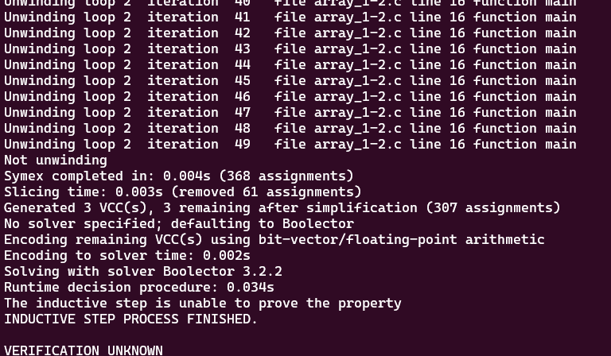

# **Tests with loop_array1-2.c**

-   [code](/tests/loop_tests/loop_array1-1/array_1-2.c)
## **What does this code do?**

- It declares an array A of size 2048.
- It then fills the first half of the array (indices 0 to 1023) with their respective indices.
- Finally, it asserts that the value at index 1023 of the array is indeed 1023.
- The functions `abort, __assert_fail, and reach_error` are used for error handling. If the condition in __VERIFIER_assert is not met (i.e., if A[1023] is not equal to 1023), the program will call reach_error and abort, indicating a failure of the assertion
- 
## **Frama-c**

-   it was made one test verifying all code related to __assert_fail, with the objective to analyze the behavior of the tool in this case.
-   the command to slice the code:
-   ```bash
    1.    frama-c -slice-calls __assert_fail ./array_1-1.c -then-on 'Slicing export' -set-project-as-default -print -then -print -ocode ./array1-1-sliced.c
    ```
-   this test made frama-c slice the unnecessary parts of the code, which were the `abort()` function call in `reach_error()` that in this case, made the same thing as return and the unnecessary statements in the `__VERIFIER_assert` function

**observations:**

-   notice that in this case, the `-slice-return` option doesn't work because it only selects the return portion of the functions, since `main` and `__VERIFIER_assert` don't return anything.
-   there isn't a `pragma` in the code so `-slice-pragma` doesn't work too since it is used to maintain the statements subsequentially after the pragma in the code, which impacts in the detection of frama-c to do not slice the __VERIFIER_assert function internal statements.

## **ESBMC**
The tests with the ESBMC verification tool will use the k-induction-parallel option, 

- the first test was with the original file, which presented a failure in the verification. Look:
       
  

## **Frama-c + ESBMC**
these tests will follow the same models for the ones in the original file.
```
ESBMC couldn't verify through the induction step, even with the slice of unnecessary parts of this code. 
```
- loop_array1-1-sliced.c
  - k-induction-parallel 

    
        
---

---

---

## to go back to the previous page: [Click me!](../../../README.md)
