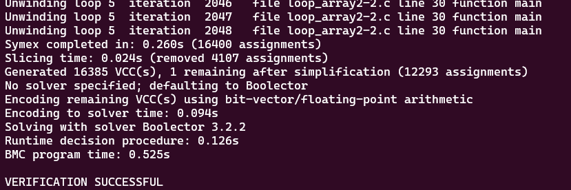
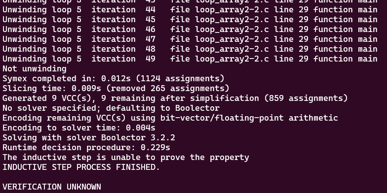
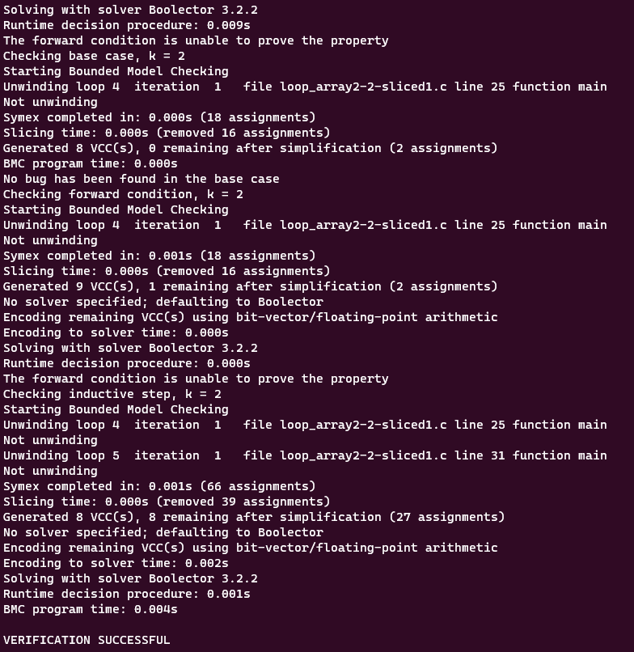
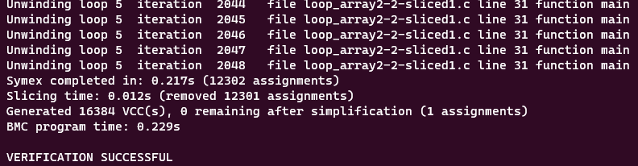
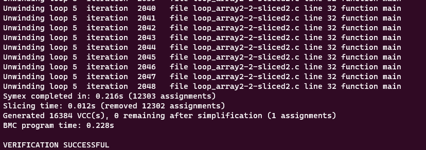

# **Tests with loop_array2-2.c**

-   [code](/tests/loop_tests/loop_array2-2/loop_array2-2.c)

## **Frama-c**

-   it was made two tests using different methods of verification, with the objective to analyze the behavior of the tool in this case.
-   these are the tests made with the frama-c slicing tool:
-   ```bash
    1.    frama-c -slice-calls reach_error ./loop_array2-2.c -then-on 'Slicing export' -set-project-as-default -print -then -print -ocode ./loop_array2-2-sliced1.c
    ```
    -   this test made frama-c slice the unnecessary parts of the code, which were the definition of SZ, that could be made inside the main function, the assert(0) function call in reach_error() that in this case, made the same thing as return and the unnecessary statements in the `__VERIFIER_assert` function

**observations:**

-   notice that in this case, the `-slice-return` option doesn't work because it only selects the return portion of the functions, since `main` and `__VERIFIER_assert` don't return anything.
-   there isn't a `pragma` in the code so `-slice-pragma` doesn't work too since it is used to maintain the statements subsequentially after the pragma in the code, which impacts in the detection of frama-c to do not slice the __VERIFIER_assert function internal statements.

## **ESBMC**
The tests with the ESBMC verification tool will use the floatbv and k-induction options, 

- the first test was with the original file, which with only the floatbv option, it goes all good, but with the k-induction option, it presented fail. Look:
- for the floatbv option 
    
    
- for the k-induction option 
    
    

## **Frama-c + ESBMC**
these tests will follow the same models for the ones in the original file.
```
Interesting discoveries were made, such as, with the sliced code in a way the ESBMC can understand better the results of the k-induction option now can achieve the status of successfull verification!, the same occurs with the floatbv option 
```
- loop_array2-2-sliced1.c
  - k-induction alone 
        
      
  - floatbv alone 
  
      
  


- loop_array2-2-sliced2.c:
  - floatbv alone
 
     
  - k-induction alone
   
      


---

---

---

## to go back to the previous page: [Click me!](../../../README.md)
