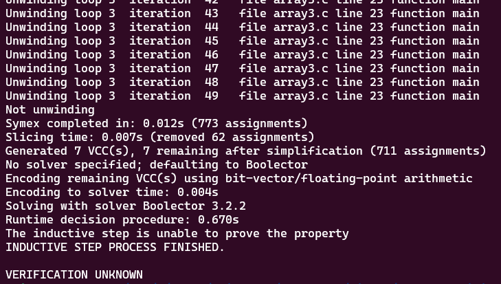
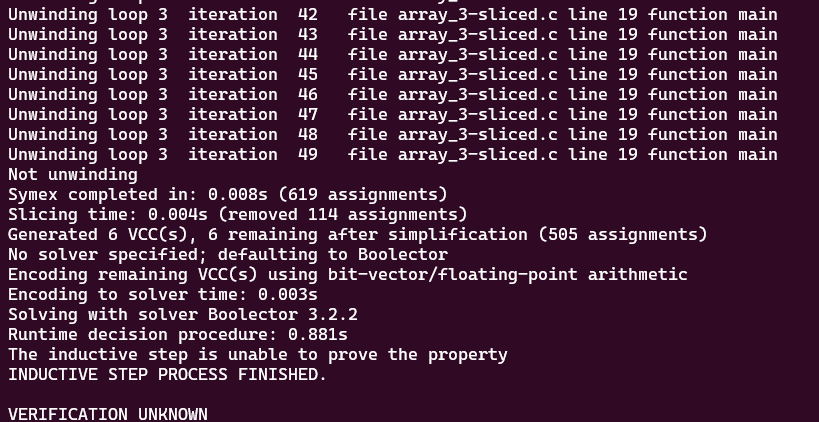

# **Tests with loop_array3.c**

-   [code](/tests/loop_tests/loop_array3/array3.c)


## **What does this code do?**

- It declares an array A of size N (which is defined as 1024).
- It then fills the array with non-deterministic integers using the __VERIFIER_nondet_int function. This function is often used in the context of formal verification or testing to represent any possible integer.
- After that, it iterates over the array until it finds a zero or reaches the end of the array.
- Finally, it asserts that the index i (the position of the first zero in the array or the size of the array if no zero is found) is less than or equal to N.

The functions `abort, assert, and reach_error` are used for error handling. If the condition in __VERIFIER_assert is not met (i.e., if i is greater than N), the program will call reach_error and abort, indicating a failure of the assertion.

## **Frama-c**

-   it was made one test verifying all code related to __assert_fail, with the objective to analyze the behavior of the tool in this case.
-   the command to slice the code:
-   ```bash
    1.   frama-c -slice-calls __VERIFIER_assert ./array3.c -then-on 'Slicing export' -set-project-as-default -print -then -print -ocode ./array_3-sliced.c
    ```
-   in this case, frama-c made it different, it opted to remove the last part of the code, determining that `__VERIFIER_assert` is unnecessary to the code. 

**observations:**

-   notice that in this case, the `-slice-return` option doesn't work because it only selects the return portion of the functions, since `main` and `__VERIFIER_assert` don't return anything.
-   there isn't a `pragma` in the code so `-slice-pragma` doesn't work too since it is used to maintain the statements subsequentially after the pragma in the code, which impacts in the detection of frama-c to do not slice the __VERIFIER_assert function internal statements.

## **ESBMC**
The tests with the ESBMC verification tool will use the k-induction-parallel option, 

- unlike the other codes analised until now, this code required much more time to finish its unwinding process, and even with more time, it reached the default upper-limit of iterations of ESBMC, which is 50. Look:
       
  

## **Frama-c + ESBMC**
these tests will follow the same models for the ones in the original file.

ESBMC couldn't verify through the induction step, even with the slice of unnecessary parts of this code. 

- loop_array1-1-sliced.c
  - k-induction-parallel 

    
        
---

---

---

## to go back to the previous page: [Click me!](../../../README.md)
