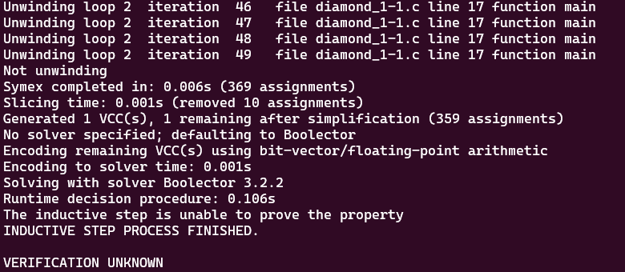
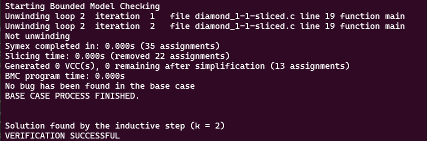

# **Tests with loop_diamond101.c**

-   [code](/tests/loop_tests/loop_diamond1-1/diamond_1-1.c)

## **What does this code do?**
- Definition of Constants and Variables:
  - Two unsigned integers, x and y, are declared. x is initialized to 0 and y is assigned a non-deterministic unsigned integer value using the function __VERIFIER_nondet_uint().

- Incrementing x:
  - `while (x < 99) { if (y % 2 == 0) { x += 2; } else { x++; } }` This loop continues until x is not less than 99. In each iteration, if y is even `(y % 2 == 0)`, then x is incremented by 2, otherwise x is incremented by 1.

- Asserting Parity:
  - `__VERIFIER_assert((x % 2) == (y % 2));` This line calls the custom assertion function __VERIFIER_assert with the condition `(x % 2) == (y % 2)`. This checks if the parity (even or odd) of x and y match. If they don't, it calls the reach_error function and then aborts program execution.
  
- The function __VERIFIER_assert(int cond) is a custom assertion function that aborts the program execution if the passed condition is false. The function` reach_error() { __assert_fail("0", "diamond_1-1.c", 3, "reach_error"); }` calls the standard __assert_fail function, which is intended to report an assertion failure.
- 
## **Frama-c**

-   it was made one test verifying all code related to reach_error, with the objective to analyze the behavior of the tool in this case.
-   the command to slice the code:
-   ```bash
    frama-c -slice-calls reach_error ./diamond_1-1.c -then-on 'Slicing export' -set-project-as-default -print -then -print -ocode ./diamond_1-1-sliced.c
    ```
-   in this case, frama-c made it really similar to the original code, removing little parts of the code.

**observations:**

-   notice that in this case, the `-slice-return` option doesn't work because it only selects the return portion of the functions, since `main` and `__VERIFIER_assert` don't return anything.
-   there isn't a `pragma` in the code so `-slice-pragma` doesn't work too since it is used to maintain the statements subsequentially after the pragma in the code, which impacts in the detection of frama-c to do not slice the __VERIFIER_assert function internal statements.

## **ESBMC**
The tests with the ESBMC verification tool will use the k-induction-parallel option, 

- unlike the other codes analised until now, this code required much more time to finish its unwinding process, and even with more time, it reached the default upper-limit of iterations of ESBMC, which is 50. Look:
       
  

## **Frama-c + ESBMC**
these tests will follow the same models for the ones in the original file.

  - Interesting discoveries were made, such as, with the sliced code in a way the ESBMC can understand better, the results of the k-induction-parallel option now can achieve the status of successfull verification! 


- loop_array1-1-sliced.c
  - k-induction-parallel 

    
        
---

---

---

## to go back to the previous page: [Click me!](../../../README.md)
