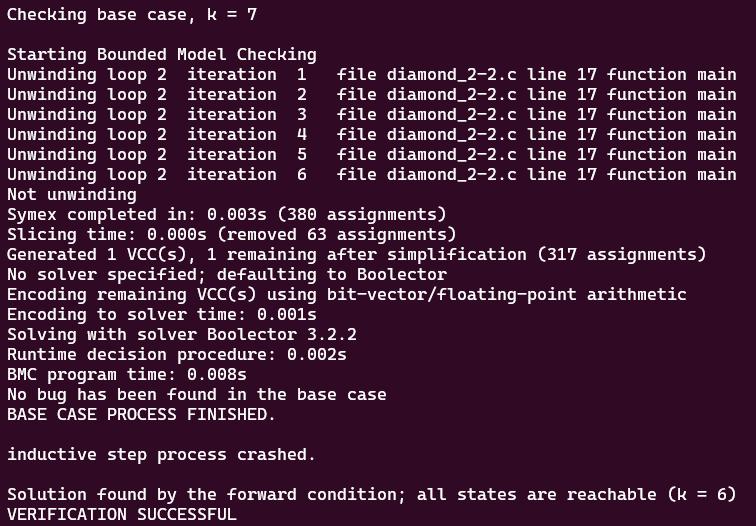
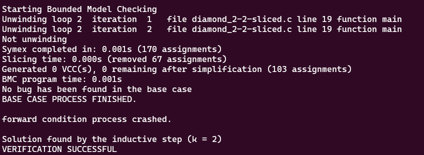

# **Tests with loop_diamond101.c**

-   [code](/tests/loop_tests/loop_diamond1-1/diamond_1-1.c)

## **What does this code do?**
- It initializes an `unsigned integer x` to `0` and another `unsigned integer y` to a non-deterministic unsigned integer using the `__VERIFIER_nondet_uint` function.

- It then enters a while loop that continues as long as `x is less than 99`. Inside this loop, `x` is incremented or decremented based on the parity (even or odd) of y. The exact operation on x varies: sometimes x is incremented by 2, sometimes it's decremented by 2 or 4, and sometimes it's incremented by 4. The operation is determined by a series of if-else statements that check if y is even or odd.

- After the loop, the program asserts that x and y have the same parity, i.e., they are both even or both odd.

- The functions `abort, __assert_fail, and reach_error` are used for error handling. If the condition in `__VERIFIER_assert` is not met (i.e., if x and y do not have the same parity), the program will call reach_error and abort, indicating a failure of the assertion.

- The `__VERIFIER_assert` function is a custom assert function. It takes a condition as an argument and if the condition is false (i.e., 0), it goes to the label ERROR where it calls the reach_error function and then aborts the program.

- The `reach_error` function is a custom function that calls __assert_fail with some arguments. The __assert_fail function is a GNU extension and is used to report an assertion failure.
  
## **Frama-c**

-   it was made one test verifying all code related to reach_error, with the objective to analyze the behavior of the tool in this case.
-   the command to slice the code:
-   ```bash
    frama-c -slice-calls reach_error ./diamond_2-2.c -then-on 'Slicing export' -set-project-as-default -print -then -print -ocode ./diamond_2-2-sliced.c
    ```
-   in this case, frama-c made it really similar to the original code, removing little parts of the code.

**observations:**

-   notice that in this case, the `-slice-return` option doesn't work because it only selects the return portion of the functions, since `main` and `__VERIFIER_assert` don't return anything.
-   there isn't a `pragma` in the code so `-slice-pragma` doesn't work too since it is used to maintain the statements subsequentially after the pragma in the code, which impacts in the detection of frama-c to do not slice the __VERIFIER_assert function internal statements.

## **ESBMC**
The tests with the ESBMC verification tool will use the k-induction-parallel option, 

- With this case, ESBMC could verify the code with the --k-induction option. Although the inductive step crashed, the forward condition could identify that all states are reachable by 6 iterations. Look:
       
  

## **Frama-c + ESBMC**
these tests will follow the same models for the ones in the original file.

- FRAMA-C COULDN'T SLICE THE __VERIFIER_assert function internal statements with the -slice-calls option, and any other type of options that the researcher tried, needs further investigation!

- loop_array1-1-sliced.c
  - k-induction-parallel 

    
        
---

---

---

## to go back to the previous page: [Click me!](../../../README.md)
