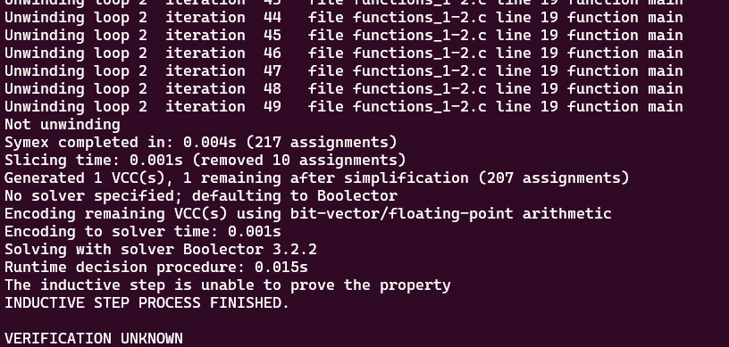

# **Tests with loop_diamond101.c**

-   [code](/tests/loop_tests/loop_diamond1-1/diamond_1-1.c)

## **What does this code do?**

- It declares a function f that accepts an unsigned integer z and returns z incremented by 2.

- In the main function, it initializes an unsigned integer x to 0.

- It then enters a while loop that continues as long as x is less than 0x0fffffff (a hexadecimal representation for 268435455). Each loop iteration updates the value of x by calling the function f with x as an argument. So, effectively, x is being incremented by 2 at each iteration.

- After the loop, the program asserts that x is an odd number. The statement x % 2 (x modulo 2) is true when x is not divisible by 2, i.e., when x is an odd number.

- Similar to the previous code examples, abort, __assert_fail, and reach_error functions, including the __VERIFIER_assert, are used for error reporting and handling. They flag an assertion failure. If x is not an odd number at the end of the program, __VERIFIER_assert will trigger an error report and abort the program execution.
  
## **Frama-c**

-   it was made various tests verifying all code related to reach_error, with the objective to analyze the behavior of the tool in this case.
-   the command to slice the code:
-   ```bash
    frama-c -slice-calls reach_error ./functions_1-2.c -then-on 'Slicing export' -set-project-as-default -print -then -print -ocode ./functions_1-2-sliced.c

    frama-c -main main -slice-calls __VERIFIER_assert,reach_error -slice-loop-var main,__VERIFIER_assert  ./functions_1-2.c -then-on 'Slicing export' -set-project-as-default -print -then -print -ocode ./functions_1-2-sliced.c

    frama-c -main main -slice-calls __VERIFIER_assert,reach_error -slice-loop-inv __VERIFIER_assert  ./functions_1-2.c -then-on 'Slicing export' -set-project-as-default -print -then -print -ocode ./functions_1-2-sliced.c

    frama-c -main main -slice-calls __VERIFIER_assert,reach_error -slice-loop-var main  ./functions_1-2.c -then-on 'Slicing export' -set-project-as-default -print -then -print -ocode ./functions_1-2-sliced.c

    frama-c -main main -slice-calls __VERIFIER_assert,reach_error -slice-wr cond  ./functions_1-2.c -then-on 'Slicing export' -set-project-as-default -print -then -print -ocode ./functions_1-2-sliced.c

    frama-c -main main -slice-calls __VERIFIER_assert,reach_error -slice-rd cond  ./functions_1-2.c -then-on 'Slicing export' -set-project-as-default -print -then -print -ocode ./functions_1-2-sliced.c

    ```
-     - FRAMA-C COULDN'T SLICE THE `__VERIFIER_assert` function internal statements to reach the `reach_error` function with the -slice-calls option, and any other type of options that the researcher tried, needs further investigation!

**observations:**

-   notice that in this case, the `-slice-return` option doesn't work because it only selects the return portion of the functions, since `main` and `__VERIFIER_assert` don't return anything.
-   there isn't a `pragma` in the code so `-slice-pragma` doesn't work too since it is used to maintain the statements subsequentially after the pragma in the code, which impacts in the detection of frama-c to do not slice the __VERIFIER_assert function internal statements.

## **ESBMC**
The tests with the ESBMC verification tool will use the k-induction-parallel option, 

- With this case, ESBMC couldn't verify the code with the --k-induction option. Look:
       
  

        
---

---

---

## to go back to the previous page: [Click me!](../../../README.md)
