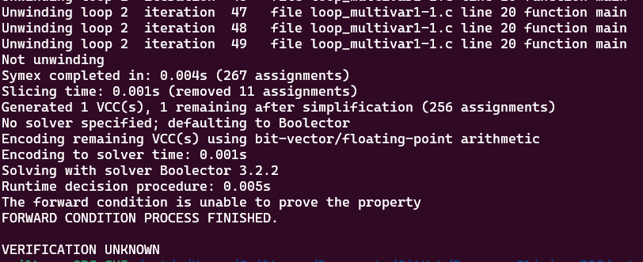
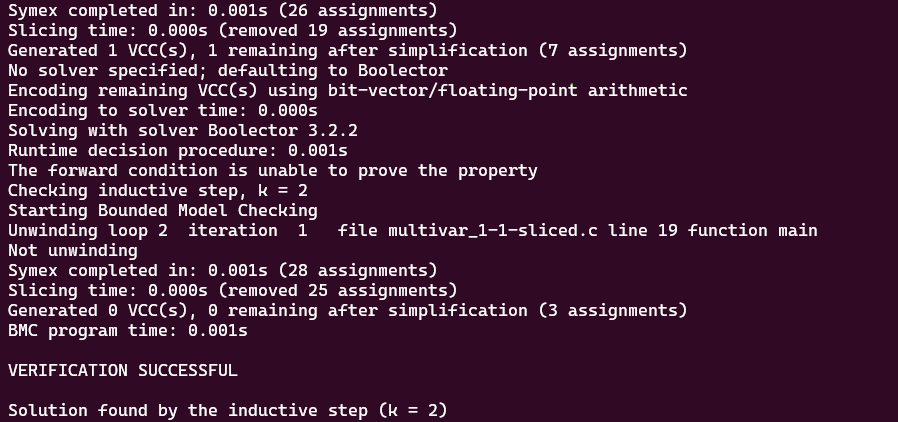

# **Tests with loop_diamond101.c**

-   [code](/tests/loop_tests/loop_diamond1-1/diamond_1-1.c)

## **What does this code do?**

- abort(void): A standard function whose job is to stop the execution of the program immediately.

- __assert_fail(const char *, const char *, unsigned int, const char *): A method meant to handle the failure of an assertion by printing an error message and stopping the program.

- reach_error(): A helper method that triggers the __assert_fail function. It's essentially used as a way to mark the point of an error in the program.

- __VERIFIER_nondet_uint(void): An abstract method that promises to return an unsigned integer, but the specifics of its implementation are left open to interpretation (and thus called nondeterministic). It's a placeholder for any potential unsigned integer.

- __VERIFIER_assert(int cond): A custom assertion method that tests a condition. If the condition fails (returns false), it calls reach_error() and aborts the program.

- main(void): The program's entry point. It sets two variables, x and y, to the same nondeterministic unsigned integer. Then, while x is less than 1024, it increments both x and y. After the loop, it validates that x and y are still equal. If this assumed property fails (which under normal operation it should never do), it asserts an error and the program is aborted.

So, in simple terms, this program is testing the assumption that incrementing two identical numbers in sync keeps them equal. It sets up that scenario, runs it in a loop, and asserts that the property holds afterwards.
  
## **Frama-c**

-   it was made various tests verifying all code related to reach_error, with the objective to analyze the behavior of the tool in this case.
-   the command to slice the code:
-   ```bash
    frama-c -slice-calls reach_error ./loop_multivar1-1.c -then-on 'Slicing export' -set-project-as-default -print -then -print -ocode ./multivar_1-1-sliced.c

    ```
-   frama-c successully sliced all the parts of the code that maintains its original behavior with the use of only one argument for slicing criterion.

**observations:**

-   notice that in this case, the `-slice-return` option doesn't work because it only selects the return portion of the functions, since `main` and `__VERIFIER_assert` don't return anything.
-   there isn't a `pragma` in the code so `-slice-pragma` doesn't work too since it is used to maintain the statements subsequentially after the pragma in the code, which impacts in the detection of frama-c to do not slice the __VERIFIER_assert function internal statements.

## **ESBMC**
The tests with the ESBMC verification tool will use the k-induction-parallel option, 

- With this case, ESBMC couldn't verify the code with the --k-induction option. Look:
       
  

## **Frama-c + ESBMC**
these tests will follow the same models for the ones in the original file.

- There's little to nothing of difference between original and sliced version of the code, the most significant difference is that all the integer constants and the results of the operations are explicitly cast to unsigned int. This doesn't change the behavior of the code, but it makes the type of these values clear.

- But this little change, made ESBMC analysis to reach solution by 2 iterations, although it changed the type of verification step that reached this state, in the original it was the forward condition, with this sliced code, it was the inductive step that reached the final state in 2 steps. 
  - k-induction-parallel 

    
 

        
---

---

---

## to go back to the previous page: [Click me!](../../../README.md)
