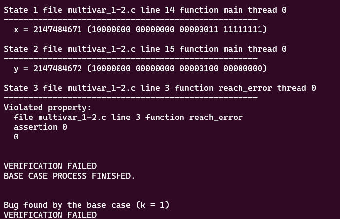
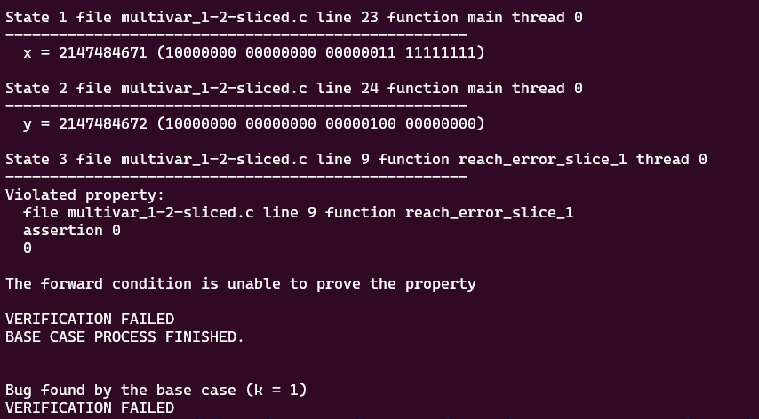

# **Tests with loop_diamond101.c**

-   [code](/tests/loop_tests/loop_diamond1-1/diamond_1-1.c)

## **What does this code do?**

- abort(void): A common library function that terminates the program execution immediately.

- __assert_fail(const char *, const char *, unsigned int, const char *): This function is used in assertion handling for failure scenarios. It displays an error message and terminates the program.

- reach_error(): This is a user-defined function that triggers the __assert_fail function upon execution. It's typically used to indicate a detectable error scenario within the program.

- __VERIFIER_nondet_uint(void): This is an external function that returns an unpredictable unsigned integer. Although the specifics of its implementation are not provided in this code, it usually functions as a placeholder for any potential unsigned integer in the context of software verification efforts.

- __VERIFIER_assert(int cond): This user-defined function checks whether a condition (cond) holds (i.e., if it's true). If the condition fails (returning false), it will trigger the reach_error() function and subsequently abort the program.

- main(void): As with every C program, execution begins with this main() function. This function begins by assigning an unpredictable unsigned integer value to x by using __VERIFIER_nondet_uint(). The program then assigns the value of x + 1 to y.

Following these assignments, the code enters into a loop wherein the values of x and y are incremented by one until x reaches 1024. After this loop, an assertion via __VERIFIER_assert(x == y) checks to verify that x and y are equal. Because of the initial assignment of y as x + 1, it is expected that the assertion test will fail, so __VERIFIER_assert() will call reach_error() and abort the program.
  
## **Frama-c**

-   it was made various tests verifying all code related to `__assert_fail`, with the objective to analyze the behavior of the tool in this case.
-   the command to slice the code:
-   ```bash
    frama-c -slice-calls reach_error ./multivar_1-2.c -then-on 'Slicing export' -set-project-as-default -print -then -print -ocode ./multivar_1-2-sliced.c
    ```
-   frama-c successully sliced all the parts of the code that maintains its original behavior with the use of only one argument for slicing criterion.

**observations:**

-   notice that in this case, the `-slice-return` option doesn't work because it only selects the return portion of the functions, since `main` and `__VERIFIER_assert` don't return anything.
-   there isn't a `pragma` in the code so `-slice-pragma` doesn't work too since it is used to maintain the statements subsequentially after the pragma in the code, which impacts in the detection of frama-c to do not slice the __VERIFIER_assert function internal statements.

## **ESBMC**
The tests with the ESBMC verification tool will use the k-induction-parallel option, 

- With this case, ESBMC verified successfully the existence of a bug in this code, reaching assertion 0. Look:
       
  

## **Frama-c + ESBMC**
these tests will follow the same models for the ones in the original file.

- The same Results with the original code were found in this sliced version of the code 

    
---

---

---

## to go back to the previous page: [Click me!](../../../README.md)
