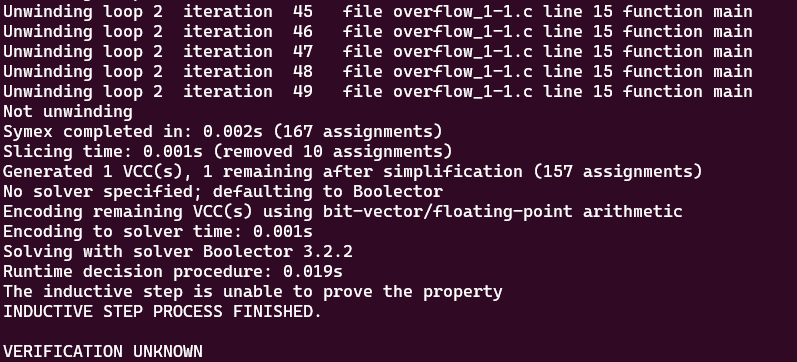

# **Tests with loop_diamond101.c**

-   [code](/tests/loop_tests/loop_diamond1-1/diamond_1-1.c)

## **What does this code do?**

- The main function initializes an unsigned integer, x, to 10.
- It then enters a loop that continues as long as x is greater than or equal to 10. Inside this loop, x is incremented by 2.
- Once the loop finishes, the program checks an assertion using the `__VERIFIER_assert` function. This assertion checks if x is even (since !(x % 2) will return 1 for even numbers and 0 for odd numbers).
- The `__VERIFIER_assert` function takes an integer condition as an argument. If the condition is false (i.e., if x is odd), it calls the reach_error function and then aborts the program.
- The reach_error function calls the `__assert_fail` function, which is an external function (presumably from an assertion library) that does not return (as indicated by the `__noreturn__` attribute). This function likely prints an error message and terminates the program.

However, it's important to note that the loop in this program will run indefinitely. Since x is initialized to 10 and is incremented by 2 in each iteration, x will always be greater than or equal to 10. This means the condition for the loop (x >= 10) will always be true, so the loop will never exit. As a result, the assertion check after the loop will never be reached.
  
## **Frama-c**

-   it was made various tests verifying all code related to `__assert_fail`, with the objective to analyze the behavior of the tool in this case.
-   the command to slice the code:
-   ```bash
    frama-c -slice-calls __assert_fail ./overflow_1-1.c -then-on 'Slicing export' -set-project-as-default -print -then -print -ocode ./overflow_1-1-sliced.c

    frama-c -main main -slice-calls __assert_fail -slice-loop-var main, ./overflow_1-1.c -then-on 'Slicing export' -set-project-as-default -print -then -print -ocode ./overflow_1-1-sliced.c

    frama-c -main main -slice-calls __assert_fail,abort ./overflow_1-1.c -then-on 'Slicing export' -set-project-as-default -print -then -print -ocode ./overflow_1-1-sliced.c

    frama-c -main main -slice-calls __assert_fail -slice-loop-var main  ./overflow_1-1.c -then-on 'Slicing export' -set-project-as-default -print -then -print -ocode ./overflow_1-1-sliced.c

    frama-c -main main -slice-calls __assert_fail -slice-wr x  ./overflow_1-1.c -then-on 'Slicing export' -set-project-as-default -print -then -print -ocode ./overflow_1-1-sliced.c

    frama-c -main main -slice-calls __assert_fail -slice-rd x  ./overflow_1-1.c -then-on 'Slicing export' -set-project-as-default -print -then -print -ocode ./overflow_1-1-sliced.c
    ```
-   FRAMA-C COULDN'T SLICE THE `__VERIFIER_assert` function internal statements to reach the `__assert_fail` function with the -slice-calls option, and any other type of options that the researcher tried, needs further investigation!
-   Because of the infinite loop in the main function, frama-c couldn't detect the real correlation between the main function x variable and the call of the `__assert_fail` function in `__VERIFIER_assert`

**observations:**

-   notice that in this case, the `-slice-return` option doesn't work because it only selects the return portion of the functions, since `main` and `__VERIFIER_assert` don't return anything.
-   there isn't a `pragma` in the code so `-slice-pragma` doesn't work too since it is used to maintain the statements subsequentially after the pragma in the code, which impacts in the detection of frama-c to do not slice the __VERIFIER_assert function internal statements.

## **ESBMC**
The tests with the ESBMC verification tool will use the k-induction-parallel option, 

-With this case, ESBMC couldn't verify the code with the --k-induction option. Look:
       
  


---

---

## to go back to the previous page: [Click me!](../../../README.md)
