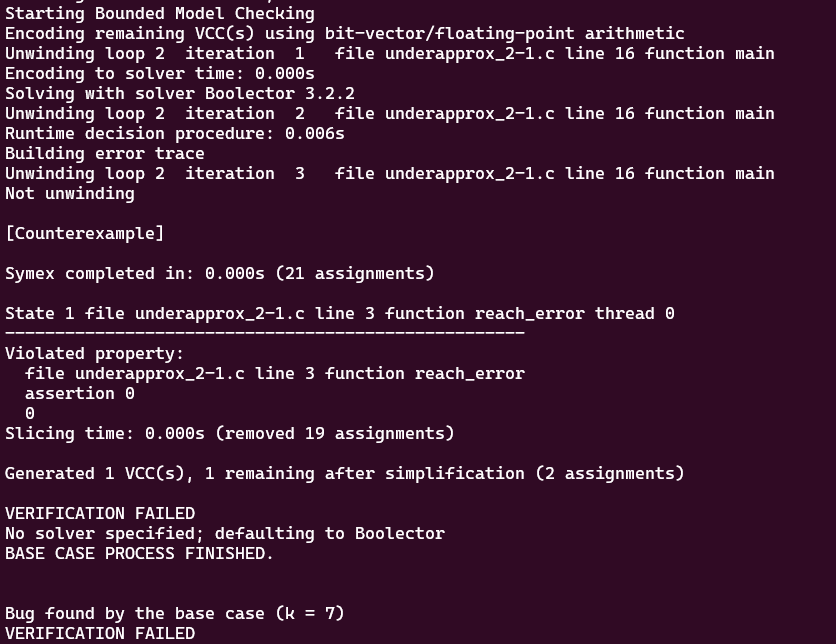

# **Tests with loop_diamond101.c**

-   [code](/tests/loop_tests/loop_diamond1-1/diamond_1-1.c)

## **What does this code do?**

- The main function initializes two unsigned integers, x and y, to 0 and 1 respectively.
- It then enters a loop that continues until `x is less than 6`. Inside this loop, x is incremented by 1 and y is multiplied by 2.
- Once the loop finishes, the program checks an assertion using the `__VERIFIER_assert` function. This assertion checks if x is not equal to 6.
- The `__VERIFIER_assert` function takes an integer condition as an argument. If the condition is false (i.e., if x is equal to 6), it calls the reach_error function and then aborts the program.
- The reach_error function calls the `__assert_fail` function, which is an external function (presumably from an assertion library) that does not return (as indicated by the `__noreturn__` attribute). This function likely prints an error message and terminates the program.

In summary, this program increments x from 0 to 5, and for each value of x, it multiplies y by 2. At the end, it checks if x is not equal to 6 and aborts the program if it is. Given the operations performed in the loop, x will indeed be 6 at the end of the loop, so the assertion will fail and the program will abort.
  
## **Frama-c**

-   it was made various tests verifying all code related to `__assert_fail`, with the objective to analyze the behavior of the tool in this case.
-   the command to slice the code:
-   ```bash
    frama-c -slice-calls __assert_fail ./underapprox_2-1.c -then-on 'Slicing export' -set-project-as-default -print -then -print -ocode ./underapprox_2-1-sliced.c

    frama-c -main main -slice-calls __assert_fail -slice-wr x,y ./underapprox_2-1.c -then-on 'Slicing export' -set-project-as-default -print -then -print -ocode ./underapprox_2-1-sliced.c

    frama-c -main main -slice-calls __assert_fail -slice-loop-var main ./underapprox_2-1.c -then-on 'Slicing export' -set-project-as-default -print -then -print -ocode ./underapprox_2-1-sliced.c

    frama-c -main main -slice-calls __assert_fail,abort ./underapprox_2-1.c -then-on 'Slicing export' -set-project-as-default -print -then -print -ocode ./underapprox_2-1-sliced.c

    frama-c -main main -slice-calls __assert_fail -slice-loop-var main  ./underapprox_2-1.c -then-on 'Slicing export' -set-project-as-default -print -then -print -ocode ./underapprox_2-1-sliced.c

    frama-c -main main -slice-calls __assert_fail -slice-wr x,y  ./underapprox_2-1.c -then-on 'Slicing export' -set-project-as-default -print -then -print -ocode ./underapprox_2-1-sliced.c

    frama-c -main main -slice-calls __assert_fail -slice-rd x,y  ./underapprox_2-1.c -then-on 'Slicing export' -set-project-as-default -print -then -print -ocode ./underapprox_2-1-sliced.c
    ```
-   In this case, it couldn't detect how the variables were important to reach the `__assert_fail` function, so it just removed the variables from the call of `__VERIFIER_assert` in main function.
**observations:**

-   notice that in this case, the `-slice-return` option doesn't work because it only selects the return portion of the functions, since `main` and `__VERIFIER_assert` don't return anything.
-   there isn't a `pragma` in the code so `-slice-pragma` doesn't work too since it is used to maintain the statements subsequentially after the pragma in the code, which impacts in the detection of frama-c to do not slice the __VERIFIER_assert function internal statements.

## **ESBMC**
The tests with the ESBMC verification tool will use the k-induction-parallel option, 

- Because of the characteristics of the code, ESBMC could identify the expected bug detection present in the code within the k=7 attempt through the --k-induction option. Look:
       
  

---

---

## to go back to the previous page: [Click me!](../../../README.md)
